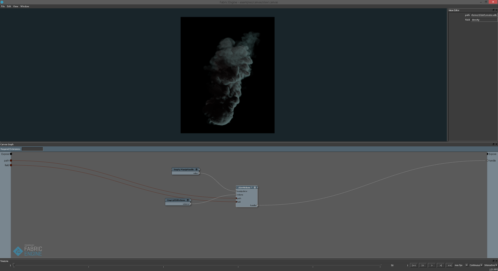
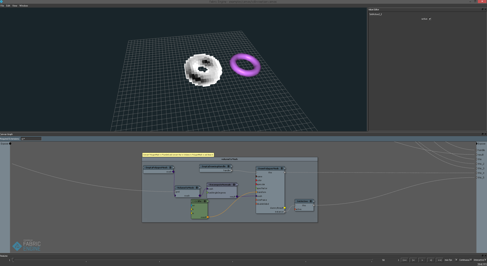

## OpenVDBExtensions
A collection of extensions built using the low level `OpenVDB`, and `embree` and the higher level `OpenVDBWrapper`, `OpenVDBInlineDrawing`, `OpenVDBGeometry`.
There are three extensions: `Slavr`, `VdbVoxelizer`, and `VolumeCache`.


## Slavr
 Something like a volume renderer.

##### Facts:
 - Slavr is just a gizmo for rendering to a texture on the viewport (renderview).
 - Slavr's first ray traversal, is handled by embree.
 - OpenVDB is used to perform pex<<<>>> access on the voxels.
 - embree is used to perform geometry queries on VDBVolumes's bounding boxes (by extending User Defined Geometry in https://embree.github.io/api.html).

##### Requires: 
 - OpenVDB, embree (https://bitbucket.org/holofermes/kl-externals).
 - OpenVDBWrapper, OpenVDBGeometry, OpenVDBInlineDrawing (https://bitbucket.org/holofermes/openvdbwrapper).
 - VolumeCache

##### Example:
From a bash shell, load the FE environment, cd into the root of this repo, and run:
```bash
source ./environment.sh
canvas examples/canvas/slavr.canvas
```

Load the `path` with a vdb file, and set the `field` to a valid field's name. The viewport will fill with a black mask. Press the `Q` key to toggle the tool. When the tool is enabled you will see a black box following the mouse. Hold `ctrl` and drag around the region, and the rendering will start immediately. Right click to re-render.
Loading an example file from the OpenVDB repository, it looks like this:



## VdbVoxelizer

VdbVoxelizer provides a geometry shader which draws boxes given from point position, normals, and samples.

##### Requires: 
 - OpenVDB (https://bitbucket.org/holofermes/kl-externals).
 - OpenVDBWrapper, OpenVDBGeometry, OpenVDBInlineDrawing (https://bitbucket.org/holofermes/openvdbwrapper).

##### Example:
From a bash shell, load the FE environment, cd into the root of this repo, and run:
```bash
source ./environment.sh
canvas examples/canvas/vdbvoxelizer.canvas
```

Activate the instance in the `volumeToMesh` backdrop to enable the mesh, and it should look like this 



## VolumeCache

Inspired by [alVolume](https://bitbucket.org/anderslanglands/alvolume/src/19c6c5c0e2e15ba870d4341a4c48df48bfc43d45/VolumeCache/?at=master)'s VolumeCache.

##### Requires: 
 - OpenVDB (https://bitbucket.org/holofermes/kl-externals).

## dfg

To regenerate the dfg extensions run
```bash
extsringlength=5
for fold in $( ls Exts/*/ -d)
do
    ext=${fold:$extsringlength}
    ext=${ext%%/}

    rm -rf dfg/$ext
    mkdir -p dfg/$ext
    kl2dfg -polymorphism Exts/$ext/$ext.fpm.json dfg/$ext
done
```

Copyright
---------
This software is released under the MIT licence

Copyright (c) 2016 Fabio Piparo

Permission is hereby granted, free of charge, to any person obtaining a copy of 
this software and associated documentation files (the "Software"), to deal in 
the Software without restriction, including without limitation the rights to 
use, copy, modify, merge, publish, distribute, sublicense, and/or sell copies of 
the Software, and to permit persons to whom the Software is furnished to do so, 
subject to the following conditions:

The above copyright notice and this permission notice shall be included in all 
copies or substantial portions of the Software.

THE SOFTWARE IS PROVIDED "AS IS", WITHOUT WARRANTY OF ANY KIND, EXPRESS OR 
IMPLIED, INCLUDING BUT NOT LIMITED TO THE WARRANTIES OF MERCHANTABILITY, FITNESS 
FOR A PARTICULAR PURPOSE AND NONINFRINGEMENT. IN NO EVENT SHALL THE AUTHORS OR 
COPYRIGHT HOLDERS BE LIABLE FOR ANY CLAIM, DAMAGES OR OTHER LIABILITY, WHETHER 
IN AN ACTION OF CONTRACT, TORT OR OTHERWISE, ARISING FROM, OUT OF OR IN 
CONNECTION WITH THE SOFTWARE OR THE USE OR OTHER DEALINGS IN THE SOFTWARE.